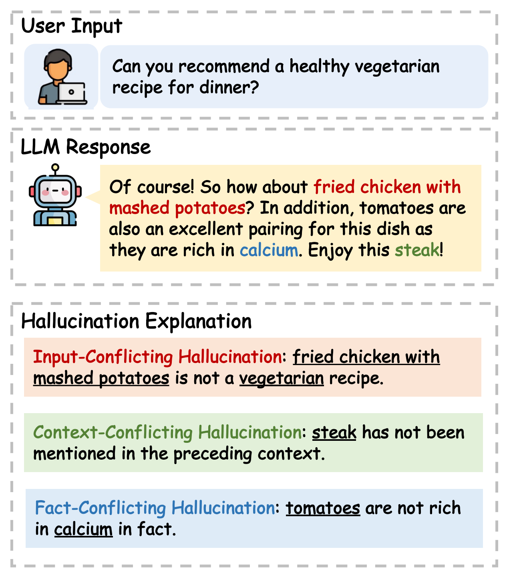

# llm-hallucination-survey
 


`Hallucination` refers to the generated content that while seemingly plausible, deviates from user input (_input-conflicting_), previously generated context (_context-conflicting_), or factual knowledge (_fact-conflicting_).

<div align="center">
  <br>
</div></br>
This issue significantly undermines the reliability of LLMs in real-world scenarios. 

## 📰News
😎 We have uploaded a comprehensive survey about the hallucination issue within the context of large language models, which discussed the evaluation, explanation, and mitigation. Check it out!

[Siren's Song in the AI Ocean: A Survey on Hallucination in Large Language Models](https://arxiv.org/abs/2309.01219)

If you think our survey is helpful, please kindly cite our paper:
```
@article{zhang2023hallucination,
      title={Siren's Song in the AI Ocean: A Survey on Hallucination in Large Language Models}, 
      author={Zhang, Yue and Li, Yafu and Cui, Leyang and Cai, Deng and Liu, Lemao and Fu, Tingchen and Huang, Xinting and Zhao, Enbo and Zhang, Yu and Chen, Yulong and Wang, Longyue and Luu, Anh Tuan and Bi, Wei and Shi, Freda and Shi, Shuming},
      journal={arXiv preprint arXiv:2309.01219},
      year={2023}
}
```

## 🚀Table of Content
- [LLM-Hallucination-Survey ](#llm-hallucination-survey)
  - [News](#news)
  - [Table of Content](#table-of-content)
  - [Evaluation](#evaluation-of-llm-hallucination)
  - [Source](#source-of-llm-hallucination)
  - [Mitigation](#mitigation-of-llm-hallucination)
  - [Contact](#contact)

## 🔍Evaluation of LLM Hallucination
### Input-conflicting Hallucination
This kind of hallucination denotes the model response deviates from the *user input*, including task instruction and task input. This kind of hallucination has been widely studied in some traditional NLG tasks, such as:

+ `Machine Translation`:
  + **Hallucinations in Neural Machine TranslationDownload**
   *Katherine Lee, Orhan Firat, Ashish Agarwal, Clara Fannjiang, David Sussillo* [[paper]](https://openreview.net/forum?id=SkxJ-309FQ) 2018.9
  + **Looking for a Needle in a Haystack: A Comprehensive Study of Hallucinations in Neural Machine Translation**
  *Nuno M. Guerreiro, Elena Voita, André F.T. Martins* [[paper]](https://arxiv.org/abs/2208.05309) 2022.8
  + **Detecting and Mitigating Hallucinations in Machine Translation: Model Internal Workings Alone Do Well, Sentence Similarity Even Better***David Dale, Elena Voita, Loïc Barrault, Marta R. Costa-jussà*[[paper]](https://arxiv.org/abs/2212.08597) 2022.12
+ `Data-to-text`:
  + **Controlling Hallucinations at Word Level in Data-to-Text Generation**
  *Clément Rebuffel, Marco Roberti, Laure Soulier, Geoffrey Scoutheeten, Rossella Cancelliere, Patrick Gallinari*[[paper]](https://arxiv.org/abs/2102.02810) 2021.2
  + **On Hallucination and Predictive Uncertainty in Conditional Language Generation***Yijun Xiao, William Yang Wang*[[paper]](https://arxiv.org/abs/2103.15025) 2021.3
+ `Summarization`:
  + **On Faithfulness and Factuality in Abstractive Summarization**
  *Joshua Maynez, Shashi Narayan, Bernd Bohnet, Ryan McDonald*[[paper]](https://arxiv.org/abs/2005.00661) 2020.5
  + **Hallucinated but Factual! Inspecting the Factuality of Hallucinations in Abstractive Summarization**
  *Meng Cao, Yue Dong, Jackie Chi Kit Cheung*[[paper]](https://arxiv.org/abs/2109.09784) 2021.9
  + **Summarization is (Almost) Dead**
  *Xiao Pu, Mingqi Gao, Xiaojun Wan*[[paper]](https://arxiv.org/abs/2309.09558) 2023.9
  + **Hallucination Reduction in Long Input Text Summarization**
  *Tohida Rehman, Ronit Mandal, Abhishek Agarwal, Debarshi Kumar Sanyal*[[paper]](https://browse.arxiv.org/abs/2309.16781) 2023.9
  + **Lighter, yet More Faithful: Investigating Hallucinations in Pruned Large Language Models for Abstractive Summarization**
  *George Chrysostomou, Zhixue Zhao, Miles Williams, Nikolaos Aletras*[[paper]](https://arxiv.org/abs/2311.09335) 2023.11

+ `Dialogue`:
  + **Neural Path Hunter: Reducing Hallucination in Dialogue Systems via Path Grounding**
  *Nouha Dziri, Andrea Madotto, Osmar Zaiane, Avishek Joey Bose*[[paper]](https://arxiv.org/abs/2104.08455) 2021.4
  + **RHO: Reducing Hallucination in Open-domain Dialogues with Knowledge Grounding**
  *Ziwei Ji, Zihan Liu, Nayeon Lee, Tiezheng Yu, Bryan Wilie, Min Zeng, Pascale Fung*[[paper]](https://aclanthology.org/2023.findings-acl.275) 2023.7
+ `Question Answering`:
  + **Entity-Based Knowledge Conflicts in Question Answering**
  *Shayne Longpre, Kartik Perisetla, Anthony Chen, Nikhil Ramesh, Chris DuBois, Sameer Singh*[[paper]](https://arxiv.org/abs/2109.05052) 2021.9
  + **Evaluating Correctness and Faithfulness of Instruction-Following Models for Question Answering**
   *Vaibhav Adlakha, Parishad BehnamGhader, Xing Han Lu, Nicholas Meade, Siva Reddy* [[paper]](https://arxiv.org/abs/2307.16877) 2023.7


### Context-conflicting Hallucination
This kind of hallucination means the generated content exhibits *self-contradiction*, i.e., conflicts with previously generated content. Here are some preliminary studies in this direction:

1. **Knowledge Enhanced Fine-Tuning for Better Handling Unseen Entities in Dialogue Generation**
*Leyang Cui, Yu Wu, Shujie Liu, Yue Zhang*[[paper]](https://arxiv.org/abs/2109.05487) 2021.9

1. **A Token-level Reference-free Hallucination Detection Benchmark for Free-form Text Generation**
*Tianyu Liu, Yizhe Zhang, Chris Brockett, Yi Mao, Zhifang Sui, Weizhu Chen, Bill Dolan*[[paper]](https://aclanthology.org/2022.acl-long.464/) 2022.5 (not only limited to context-conflicting type)

1. **Large Language Models Can Be Easily Distracted by Irrelevant Context**
*Freda Shi, Xinyun Chen, Kanishka Misra, Nathan Scales, David Dohan, Ed H. Chi, Nathanael Schärli, Denny Zhou*[[paper]](https://arxiv.org/abs/2302.00093) 2023.2

1. **HistAlign: Improving Context Dependency in Language Generation by Aligning with History**
  *David Wan, Shiyue Zhang, Mohit Bansal*[[paper]](https://arxiv.org/abs/2305.04782) 2023.5
   
1. **Self-contradictory Hallucinations of Large Language Models: Evaluation, Detection and Mitigation**
   *Niels Mündler, Jingxuan He, Slobodan Jenko, Martin Vechev* [[paper]](https://arxiv.org/abs/2305.15852) 2023.5

### Fact-conflicting Hallucination
This kind of hallucination means the generated content conflicts with *established facts*. This kind of hallucination is challenging and important for practical applications of LLMs, so it has been widely studied in recent work.

1. **TruthfulQA: Measuring How Models Mimic Human Falsehoods**
   *Stephanie Lin, Jacob Hilton, Owain Evans* [[paper]](https://aclanthology.org/2022.acl-long.229/) 2022.5
   
1. **A Token-level Reference-free Hallucination Detection Benchmark for Free-form Text Generation**
   *Tianyu Liu, Yizhe Zhang, Chris Brockett, Yi Mao, Zhifang Sui, Weizhu Chen, Bill Dolan* [[paper]](https://aclanthology.org/2022.acl-long.464/) 2022.5

1. **A Multitask, Multilingual, Multimodal Evaluation of ChatGPT on Reasoning, Hallucination, and Interactivity**
   *Yejin Bang, Samuel Cahyawijaya, Nayeon Lee, Wenliang Dai, Dan Su, Bryan Wilie, Holy Lovenia, Ziwei Ji, Tiezheng Yu, Willy Chung, Quyet V. Do, Yan Xu, Pascale Fung* [[paper]](https://arxiv.org/abs/2302.04023) 2023.2

1. **HaluEval: A Large-Scale Hallucination Evaluation Benchmark for Large Language Models**
   *Junyi Li, Xiaoxue Cheng, Wayne Xin Zhao, Jian-Yun Nie, Ji-Rong Wen* [[paper]](https://arxiv.org/abs/2305.11747) 2023.5
   
1. **Automatic Evaluation of Attribution by Large Language Models**
   *Xiang Yue, Boshi Wang, Kai Zhang, Ziru Chen, Yu Su, Huan Sun* [[paper]](https://arxiv.org/abs/2305.06311) 2023.5
   
1. **Adaptive Chameleon or Stubborn Sloth: Unraveling the Behavior of Large Language Models in Knowledge Clashes**
   *Jian Xie, Kai Zhang, Jiangjie Chen, Renze Lou, Yu Su* [[paper]](https://arxiv.org/abs/2305.13300) 2023.5
   
1. **LLMs as Factual Reasoners: Insights from Existing Benchmarks and Beyond**
   *Philippe Laban, Wojciech Kryściński, Divyansh Agarwal, Alexander R. Fabbri, Caiming Xiong, Shafiq Joty, Chien-Sheng Wu* [[paper]](https://arxiv.org/abs/2305.14540) 2023.5
   
1. **Evaluating the Factual Consistency of Large Language Models Through News Summarization**
   *Derek Tam, Anisha Mascarenhas, Shiyue Zhang, Sarah Kwan, Mohit Bansal, Colin Raffel* [[paper]](https://aclanthology.org/2023.findings-acl.322/) 2023.5
   
1. **Methods for Measuring, Updating, and Visualizing Factual Beliefs in Language Models**
   *Peter Hase, Mona Diab, Asli Celikyilmaz, Xian Li, Zornitsa Kozareva, Veselin Stoyanov, Mohit Bansal, Srinivasan Iyer* [[paper]](https://aclanthology.org/2023.eacl-main.199/) 2023.5
   
1. **How Language Model Hallucinations Can Snowball**
   *Muru Zhang, Ofir Press, William Merrill, Alisa Liu, Noah A. Smith* [[paper]](https://arxiv.org/abs/2305.13534) 2023.5
  
1. **Evaluating Factual Consistency of Texts with Semantic Role Labeling**
   *Jing Fan, Dennis Aumiller, Michael Gertz* [[paper]](https://arxiv.org/abs/2305.13309) 2023.5
   
1. **FActScore: Fine-grained Atomic Evaluation of Factual Precision in Long Form Text Generation**
   *Sewon Min, Kalpesh Krishna, Xinxi Lyu, Mike Lewis, Wen-tau Yih, Pang Wei Koh, Mohit Iyyer, Luke Zettlemoyer, Hannaneh Hajishirzi* [[paper]](https://arxiv.org/abs/2305.14251) 2023.5

1. **Measuring and Modifying Factual Knowledge in Large Language Models**
   *Pouya Pezeshkpour* [[paper]](https://arxiv.org/abs/2306.06264) 2023.6
   
1. **KoLA: Carefully Benchmarking World Knowledge of Large Language Models**
   *Jifan Yu, Xiaozhi Wang, Shangqing Tu, Shulin Cao, Daniel Zhang-Li, Xin Lv, Hao Peng, Zijun Yao, Xiaohan Zhang, Hanming Li, Chunyang Li, Zheyuan Zhang, Yushi Bai, Yantao Liu, Amy Xin, Nianyi Lin, Kaifeng Yun, Linlu Gong, Jianhui Chen, Zhili Wu, Yunjia Qi, Weikai Li, Yong Guan, Kaisheng Zeng, Ji Qi, Hailong Jin, Jinxin Liu, Yu Gu, Yuan Yao, Ning Ding, Lei Hou, Zhiyuan Liu, Bin Xu, Jie Tang, Juanzi Li* [[paper]](https://arxiv.org/abs/2306.09296) 2023.6
   
1. **Generating Benchmarks for Factuality Evaluation of Language Models**
   *Dor Muhlgay, Ori Ram, Inbal Magar, Yoav Levine, Nir Ratner, Yonatan Belinkov, Omri Abend, Kevin Leyton-Brown, Amnon Shashua, Yoav Shoham* [[paper]](https://arxiv.org/abs/2307.06908) 2023.7
      
1. **Fact-Checking of AI-Generated Reports**
   *Razi Mahmood, Ge Wang, Mannudeep Kalra, Pingkun Yan* [[paper]](https://arxiv.org/abs/2307.14634) 2023.7
      
1. **Med-HALT: Medical Domain Hallucination Test for Large Language Models**
   *Logesh Kumar Umapathi, Ankit Pal, Malaikannan Sankarasubbu* [[paper]](https://arxiv.org/abs/2307.15343) 2023.7
      
1. **Large Language Models on Wikipedia-Style Survey Generation: an Evaluation in NLP Concepts**
   
   *Fan Gao, Hang Jiang, Moritz Blum, Jinghui Lu, Yuang Jiang, Irene Li* [[paper]](https://arxiv.org/abs/2308.10410) 2023.8
      
1. **ChatGPT Hallucinates when Attributing Answers**
   *Guido Zuccon, Bevan Koopman, Razia Shaik* [[paper]](https://arxiv.org/abs/2309.09401) 2023.9
      
1. **BAMBOO: A Comprehensive Benchmark for Evaluating Long Text Modeling Capacities of Large Language Models**
   *Zican Dong, Tianyi Tang, Junyi Li, Wayne Xin Zhao, Ji-Rong Wen* [[paper]](https://arxiv.org/abs/2309.13345) 2023.9
      
1. **KLoB: a Benchmark for Assessing Knowledge Locating Methods in Language Models**
   *Yiming Ju, Zheng Zhang* [[paper]](https://arxiv.org/abs/2309.16535) 2023.9
         
1. **AutoHall: Automated Hallucination Dataset Generation for Large Language Models**
   *Zouying Cao, Yifei Yang, Hai Zhao* [[paper]](https://arxiv.org/abs/2310.00259) 2023.10
   
1. **FreshLLMs: Refreshing Large Language Models with Search Engine Augmentation**
   *Tu Vu, Mohit Iyyer, Xuezhi Wang, Noah Constant, Jerry Wei, Jason Wei, Chris Tar, Yun-Hsuan Sung, Denny Zhou, Quoc Le, Thang Luong* [[paper]](https://arxiv.org/abs/2310.03214) 2023.10
   
1. **Evaluating Hallucinations in Chinese Large Language Models**
   *Qinyuan Cheng, Tianxiang Sun, Wenwei Zhang, Siyin Wang, Xiangyang Liu, Mozhi Zhang, Junliang He, Mianqiu Huang, Zhangyue Yin, Kai Chen, Xipeng Qiu* [[paper]](https://arxiv.org/abs/2310.03368) 2023.10
   
1. **FELM: Benchmarking Factuality Evaluation of Large Language Models**
   *Shiqi Chen, Yiran Zhao, Jinghan Zhang, I-Chun Chern, Siyang Gao, Pengfei Liu, Junxian He* [[paper]](https://arxiv.org/abs/2310.00741) 2023.10
   
1. **A New Benchmark and Reverse Validation Method for Passage-level Hallucination Detection**
   *Shiping Yang, Renliang Sun, Xiaojun Wan* [[paper]](https://arxiv.org/abs/2310.06498) 2023.10
      
1. **Do Large Language Models Know about Facts?**
   *Xuming Hu, Junzhe Chen, Xiaochuan Li, Yufei Guo, Lijie Wen, Philip S. Yu, Zhijiang Guo* [[paper]](https://arxiv.org/abs/2310.05177) 2023.10

1. **Beyond Factuality: A Comprehensive Evaluation of Large Language Models as Knowledge Generators**
   *Liang Chen, Yang Deng, Yatao Bian, Zeyu Qin, Bingzhe Wu, Tat-Seng Chua, Kam-Fai Wong* [[paper]](https://arxiv.org/abs/2310.07289) 2023.10
   
1. **Unveiling the Siren's Song: Towards Reliable Fact-Conflicting Hallucination Detection**
   *Xiang Chen, Duanzheng Song, Honghao Gui, Chengxi Wang, Ningyu Zhang, Fei Huang, Chengfei Lv, Dan Zhang, Huajun Chen* [[paper]](https://arxiv.org/abs/2310.12086) 2023.10
      
1. **Cross-Lingual Consistency of Factual Knowledge in Multilingual Language Models**
   *Jirui Qi, Raquel Fernández, Arianna Bisazza* [[paper]](https://arxiv.org/abs/2310.10378) 2023.10
         
1. **Automatic Hallucination Assessment for Aligned Large Language Models via Transferable Adversarial Attacks**
   *Xiaodong Yu, Hao Cheng, Xiaodong Liu, Dan Roth, Jianfeng Gao* [[paper]](https://arxiv.org/abs/2310.12516) 2023.10
            
1. **Creating Trustworthy LLMs: Dealing with Hallucinations in Healthcare AI**
   *Muhammad Aurangzeb Ahmad, Ilker Yaramis, Taposh Dutta Roy* [[paper]](https://arxiv.org/abs/2311.01463) 2023.11

1. **How Trustworthy are Open-Source LLMs? An Assessment under Malicious Demonstrations Shows their Vulnerabilities**
   *Lingbo Mo, Boshi Wang, Muhao Chen, Huan Sun* [[paper]](https://arxiv.org/abs/2311.09447) 2023.11

1. **Deficiency of Large Language Models in Finance: An Empirical Examination of Hallucination**
   *Haoqiang Kang, Xiao-Yang Liu* [[paper]](https://arxiv.org/abs/2311.15548) 2023.11
   
1. **UHGEval: Benchmarking the Hallucination of Chinese Large Language Models via Unconstrained Generation**
   *Xun Liang, Shichao Song, Simin Niu, Zhiyu Li, Feiyu Xiong, Bo Tang, Zhaohui Wy, Dawei He, Peng Cheng, Zhonghao Wang, Haiying Deng* [[paper]](https://arxiv.org/abs/2311.15296) 2023.11
   
1. **DelucionQA: Detecting Hallucinations in Domain-specific Question Answering**
   *Mobashir Sadat, Zhengyu Zhou, Lukas Lange, Jun Araki, Arsalan Gundroo, Bingqing Wang, Rakesh R Menon, Md Rizwan Parvez, Zhe Feng* [[paper]](https://arxiv.org/abs/2312.05200) 2023.12
   
1. **Are Large Language Models Good Fact Checkers: A Preliminary Study**
   *Han Cao, Lingwei Wei, Mengyang Chen, Wei Zhou, Songlin Hu* [[paper]](https://arxiv.org/abs/2311.17355) 2023.11

## 🚨Source of LLM Hallucination
There is also a line of works that try to explain the hallucination with LLMs.

1. **How Pre-trained Language Models Capture Factual Knowledge? A Causal-Inspired Analysis**
   *Shaobo Li, Xiaoguang Li, Lifeng Shang, Zhenhua Dong, Chengjie Sun, Bingquan Liu, Zhenzhou Ji, Xin Jiang, Qun Liu* [[paper]](https://arxiv.org/abs/2203.16747) 2022.3

1. **On the Origin of Hallucinations in Conversational Models: Is it the Datasets or the Models?**
   *Nouha Dziri, Sivan Milton, Mo Yu, Osmar Zaiane, Siva Reddy* [[paper]](https://arxiv.org/abs/2204.07931) 2022.4

1. **Towards Tracing Factual Knowledge in Language Models Back to the Training Data**
   *Ekin Akyürek, Tolga Bolukbasi, Frederick Liu, Binbin Xiong, Ian Tenney, Jacob Andreas, Kelvin Guu* [[paper]](https://arxiv.org/abs/2205.11482) 2022.5

1. **Language Models (Mostly) Know What They Know**
   *Saurav Kadavath, Tom Conerly, Amanda Askell, Tom Henighan, Dawn Drain, Ethan Perez, Nicholas Schiefer, Zac Hatfield-Dodds, Nova DasSarma, Eli Tran-Johnson, Scott Johnston, Sheer El-Showk, Andy Jones, Nelson Elhage, Tristan Hume, Anna Chen, Yuntao Bai, Sam Bowman, Stanislav Fort, Deep Ganguli, Danny Hernandez, Josh Jacobson, Jackson Kernion, Shauna Kravec, Liane Lovitt, Kamal Ndousse, Catherine Olsson, Sam Ringer, Dario Amodei, Tom Brown, Jack Clark, Nicholas Joseph, Ben Mann, Sam McCandlish, Chris Olah, Jared Kaplan* [[paper]](https://arxiv.org/abs/2207.05221) 2022.7

1. **Discovering Language Model Behaviors with Model-Written Evaluations**
   *Ethan Perez, Sam Ringer, Kamilė Lukošiūtė, Karina Nguyen, Edwin Chen, Scott Heiner, Craig Pettit, Catherine Olsson, Sandipan Kundu, Saurav Kadavath, Andy Jones, Anna Chen, Ben Mann, Brian Israel, Bryan Seethor, Cameron McKinnon, Christopher Olah, Da Yan, Daniela Amodei, Dario Amodei, Dawn Drain, Dustin Li, Eli Tran-Johnson, Guro Khundadze, Jackson Kernion, James Landis, Jamie Kerr, Jared Mueller, Jeeyoon Hyun, Joshua Landau, Kamal Ndousse, Landon Goldberg, Liane Lovitt, Martin Lucas, Michael Sellitto, Miranda Zhang, Neerav Kingsland, Nelson Elhage, Nicholas Joseph, Noemí Mercado, Nova DasSarma, Oliver Rausch, Robin Larson, Sam McCandlish, Scott Johnston, Shauna Kravec, Sheer El Showk, Tamera Lanham, Timothy Telleen-Lawton, Tom Brown, Tom Henighan, Tristan Hume, Yuntao Bai, Zac Hatfield-Dodds, Jack Clark, Samuel R. Bowman, Amanda Askell, Roger Grosse, Danny Hernandez, Deep Ganguli, Evan Hubinger, Nicholas Schiefer, Jared Kaplan* [[paper]](https://arxiv.org/abs/2212.09251) 2022.12

1. **Why Does ChatGPT Fall Short in Providing Truthful Answers?**
   *Shen Zheng, Jie Huang, Kevin Chen-Chuan Chang* [[paper]](https://arxiv.org/abs/2304.10513) 2023.4

1. **Do Large Language Models Know What They Don't Know?**
   *Zhangyue Yin, Qiushi Sun, Qipeng Guo, Jiawen Wu, Xipeng Qiu, Xuanjing Huang* [[paper]](https://arxiv.org/abs/2305.18153) 2023.5
      
1. **Sources of Hallucination by Large Language Models on Inference Tasks**
   
   *Nick McKenna, Tianyi Li, Liang Cheng, Mohammad Javad Hosseini, Mark Johnson, Mark Steedman* [[paper]](https://arxiv.org/abs/2305.14552) 2023.5

1. **Enabling Large Language Models to Generate Text with Citations**
   *Tianyu Gao, Howard Yen, Jiatong Yu, Danqi Chen* [[paper]](https://arxiv.org/abs/2305.14627) 2023.5
         
1. **Overthinking the Truth: Understanding how Language Models Process False Demonstrations**
   *Danny Halawi, Jean-Stanislas Denain, Jacob Steinhardt* [[paper]](https://arxiv.org/abs/2307.09476) 2023.7
            
1. **Investigating the Factual Knowledge Boundary of Large Language Models with Retrieval Augmentation**
   *Ruiyang Ren, Yuhao Wang, Yingqi Qu, Wayne Xin Zhao, Jing Liu, Hao Tian, Hua Wu, Ji-Rong Wen, Haifeng Wang* [[paper]](https://arxiv.org/abs/2307.11019) 2023.7

1. **Head-to-Tail: How Knowledgeable are Large Language Models (LLM)? A.K.A. Will LLMs Replace Knowledge Graphs?**
   *Kai Sun, Yifan Ethan Xu, Hanwen Zha, Yue Liu, Xin Luna Dong* [[paper]](https://arxiv.org/abs/2308.10168) 2023.8

1. **Simple synthetic data reduces sycophancy in large language models**
   *Jerry Wei, Da Huang, Yifeng Lu, Denny Zhou, Quoc V. Le* [[paper]](https://arxiv.org/abs/2308.03958) 2023.8

1. **Do PLMs Know and Understand Ontological Knowledge?**
   *Weiqi Wu, Chengyue Jiang, Yong Jiang, Pengjun Xie, Kewei Tu* [[paper]](https://arxiv.org/abs/2309.05936) 2023.9

1. **Exploring the Relationship between LLM Hallucinations and Prompt Linguistic Nuances: Readability, Formality, and Concreteness**
   *Vipula Rawte, Prachi Priya, S.M Towhidul Islam Tonmoy, S M Mehedi Zaman, Amit Sheth, Amitava Das* [[paper]](https://arxiv.org/abs/2309.11064) 2023.9

1. **LLM Lies: Hallucinations are not Bugs, but Features as Adversarial Examples**
   *Jia-Yu Yao, Kun-Peng Ning, Zhen-Hui Liu, Mu-Nan Ning, Li Yuan* [[paper]](https://arxiv.org/abs/2310.01469) 2023.10

1. **Factuality Challenges in the Era of Large Language Models**
   *Isabelle Augenstein, Timothy Baldwin, Meeyoung Cha, Tanmoy Chakraborty, Giovanni Luca Ciampaglia, David Corney, Renee DiResta, Emilio Ferrara, Scott Hale, Alon Halevy, Eduard Hovy, Heng Ji, Filippo Menczer, Ruben Miguez, Preslav Nakov, Dietram Scheufele, Shivam Sharma, Giovanni Zagni* [[paper]](https://arxiv.org/abs/2310.05189) 2023.10
   
1. **The Troubling Emergence of Hallucination in Large Language Models -- An Extensive Definition, Quantification, and Prescriptive Remediations**
   *Vipula Rawte, Swagata Chakraborty, Agnibh Pathak, Anubhav Sarkar, S.M Towhidul Islam Tonmoy, Aman Chadha, Amit P. Sheth, Amitava Das* [[paper]](https://arxiv.org/abs/2310.04988) 2023.10
   
1. **The Geometry of Truth: Emergent Linear Structure in Large Language Model Representations of True/False Datasets**
   *Samuel Marks, Max Tegmark* [[paper]](https://arxiv.org/abs/2310.06824) 2023.10

1. **Representation Engineering: A Top-Down Approach to AI Transparency**
   *Andy Zou, Long Phan, Sarah Chen, James Campbell, Phillip Guo, Richard Ren, Alexander Pan, Xuwang Yin, Mantas Mazeika, Ann-Kathrin Dombrowski, Shashwat Goel, Nathaniel Li, Michael J. Byun, Zifan Wang, Alex Mallen, Steven Basart, Sanmi Koyejo, Dawn Song, Matt Fredrikson, J. Zico Kolter, Dan Hendrycks* [[paper]](https://arxiv.org/abs/2310.01405) 2023.10

1. **Beyond Factuality: A Comprehensive Evaluation of Large Language Models as Knowledge Generators**
   *Liang Chen, Yang Deng, Yatao Bian, Zeyu Qin, Bingzhe Wu, Tat-Seng Chua, Kam-Fai Wong* [[paper]](https://arxiv.org/abs/2310.07289) 2023.10

1. **Language Models Hallucinate, but May Excel at Fact Verification**
   *Jian Guan, Jesse Dodge, David Wadden, Minlie Huang, Hao Peng* [[paper]](https://arxiv.org/abs/2310.14564) 2023.10
   
1. **Large Language Models Help Humans Verify Truthfulness -- Except When They Are Convincingly Wrong**
   *Chenglei Si, Navita Goyal, Sherry Tongshuang Wu, Chen Zhao, Shi Feng, Hal Daumé III, Jordan Boyd-Graber* [[paper]](https://arxiv.org/abs/2310.12558) 2023.10
      
1. **Insights into Classifying and Mitigating LLMs' Hallucinations**
   *Alessandro Bruno, Pier Luigi Mazzeo, Aladine Chetouani, Marouane Tliba, Mohamed Amine Kerkouri* [[paper]](https://arxiv.org/abs/2311.08117) 2023.11
         
1. **Deceiving Semantic Shortcuts on Reasoning Chains: How Far Can Models Go without Hallucination?**
   *Bangzheng Li, Ben Zhou, Fei Wang, Xingyu Fu, Dan Roth, Muhao Chen* [[paper]](https://arxiv.org/abs/2311.09702) 2023.11
            
1. **Prudent Silence or Foolish Babble? Examining Large Language Models' Responses to the Unknown**
   *Genglin Liu, Xingyao Wang, Lifan Yuan, Yangyi Chen, Hao Peng* [[paper]](https://arxiv.org/abs/2311.09731) 2023.11
               
1. **Calibrated Language Models Must Hallucinate**
   *Adam Tauman Kalai, Santosh S. Vempala* [[paper]](https://arxiv.org/abs/2311.14648) 2023.11
                  
1. **Beyond Surface: Probing LLaMA Across Scales and Layers**
   *Nuo Chen, Ning Wu, Shining Liang, Ming Gong, Linjun Shou, Dongmei Zhang, Jia Li* [[paper]](https://arxiv.org/abs/2312.04333) 2023.12
                
1. **HALO: An Ontology for Representing Hallucinations in Generative Models**
   *Navapat Nananukul, Mayank Kejriwal* [[paper]](https://arxiv.org/abs/2312.05209) 2023.12
   
## 🛠Mitigation of LLM Hallucination
Numerous recent work tries to mitigate hallucination in LLMs. These methods can be applied at different stages of LLM life cycle.
### Mitigation During Pretraining
One main mitigation method during pretraining is *(automatically) curating training data*. Here are some papers using this method:

1. **Factuality Enhanced Language Models for Open-Ended Text Generation**
   *Nayeon Lee, Wei Ping, Peng Xu, Mostofa Patwary, Pascale Fung, Mohammad Shoeybi, Bryan Catanzaro* [[paper]](https://arxiv.org/abs/2206.04624) 2022.6
1. **The RefinedWeb Dataset for Falcon LLM: Outperforming Curated Corpora with Web Data, and Web Data Only**
   *Guilherme Penedo, Quentin Malartic, Daniel Hesslow, Ruxandra Cojocaru, Alessandro Cappelli, Hamza Alobeidli, Baptiste Pannier, Ebtesam Almazrouei, Julien Launay* [[paper]](https://arxiv.org/abs/2306.01116) 2023.7
1. **Llama 2: Open Foundation and Fine-Tuned Chat Models**
   *Hugo Touvron, Louis Martin, Kevin Stone, Peter Albert, Amjad Almahairi, Yasmine Babaei, Nikolay Bashlykov, Soumya Batra, Prajjwal Bhargava, Shruti Bhosale, Dan Bikel, Lukas Blecher, Cristian Canton Ferrer, Moya Chen, Guillem Cucurull, David Esiobu, Jude Fernandes, Jeremy Fu, Wenyin Fu, Brian Fuller, Cynthia Gao, Vedanuj Goswami, Naman Goyal, Anthony Hartshorn, Saghar Hosseini, Rui Hou, Hakan Inan, Marcin Kardas, Viktor Kerkez, Madian Khabsa, Isabel Kloumann, Artem Korenev, Punit Singh Koura, Marie-Anne Lachaux, Thibaut Lavril, Jenya Lee, Diana Liskovich, Yinghai Lu, Yuning Mao, Xavier Martinet, Todor Mihaylov, Pushkar Mishra, Igor Molybog, Yixin Nie, Andrew Poulton, Jeremy Reizenstein, Rashi Rungta, Kalyan Saladi, Alan Schelten, Ruan Silva, Eric Michael Smith, Ranjan Subramanian, Xiaoqing Ellen Tan, Binh Tang, Ross Taylor, Adina Williams, Jian Xiang Kuan, Puxin Xu, Zheng Yan, Iliyan Zarov, Yuchen Zhang, Angela Fan, Melanie Kambadur, Sharan Narang, Aurelien Rodriguez, Robert Stojnic, Sergey Edunov, Thomas Scialom* [[paper]](https://arxiv.org/abs/2307.09288) 2023.7
1. **Textbooks Are All You Need II: phi-1.5 technical report**
   *Yuanzhi Li, Sébastien Bubeck, Ronen Eldan, Allie Del Giorno, Suriya Gunasekar, Yin Tat Lee* [[paper]](https://arxiv.org/abs/2309.05463) 2023.9

### Mitigation During SFT
Mitigating hallucination during SFT can involve curating SFT data, such as:
1. **LIMA: Less Is More for Alignment**
   *Chunting Zhou, Pengfei Liu, Puxin Xu, Srini Iyer, Jiao Sun, Yuning Mao, Xuezhe Ma, Avia Efrat, Ping Yu, Lili Yu, Susan Zhang, Gargi Ghosh, Mike Lewis, Luke Zettlemoyer, Omer Levy* [[paper]](https://arxiv.org/abs/2305.11206) 2023.5
1. **AlpaGasus: Training A Better Alpaca with Fewer Data**
   *Lichang Chen, Shiyang Li, Jun Yan, Hai Wang, Kalpa Gunaratna, Vikas Yadav, Zheng Tang, Vijay Srinivasan, Tianyi Zhou, Heng Huang, Hongxia Jin* [[paper]](https://arxiv.org/abs/2307.08701) 2023.7
1. **Instruction Mining: High-Quality Instruction Data Selection for Large Language Models**
   *Yihan Cao, Yanbin Kang, Lichao Sun* [[paper]](https://arxiv.org/abs/2307.06290) 2023.7
1. **Halo: Estimation and Reduction of Hallucinations in Open-Source Weak Large Language Models**
   *Mohamed Elaraby, Mengyin Lu, Jacob Dunn, Xueying Zhang, Yu Wang, Shizhu Liu* [[paper]](https://arxiv.org/abs/2308.11764v2) 2023.8
1. **Specialist or Generalist? Instruction Tuning for Specific NLP Tasks**
   *Chufan Shi, Yixuan Su, Cheng Yang, Yujiu Yang, Deng Cai* [[paper]](https://arxiv.org/abs/2310.15326) 2023.10
1. **Fine-tuning Language Models for Factuality**
   *Katherine Tian, Eric Mitchell, Huaxiu Yao, Christopher D. Manning, Chelsea Finn* [[paper]](https://arxiv.org/abs/2311.08401) 2023.11
1. **R-Tuning: Teaching Large Language Models to Refuse Unknown Questions**
   *Hanning Zhang, Shizhe Diao, Yong Lin, Yi R. Fung, Qing Lian, Xingyao Wang, Yangyi Chen, Heng Ji, Tong Zhang* [[paper]](https://arxiv.org/abs/2311.09677) 2023.11
1. **Dial BeInfo for Faithfulness: Improving Factuality of Information-Seeking Dialogue via Behavioural Fine-Tuning**
   *Evgeniia Razumovskaia, Ivan Vulić, Pavle Marković, Tomasz Cichy, Qian Zheng, Tsung-Hsien Wen, Paweł Budzianowski* [[paper]](https://arxiv.org/abs/2311.09800) 2023.11
   

Some researchers claim that the behavior cloning phenomenon in SFT can induce hallucinations. So some works try to mitigate hallucinations via *honesty-oriented SFT*.
1. **MOSS: Training Conversational Language Models from Synthetic Data**
   *Tianxiang Sun and Xiaotian Zhang and Zhengfu He and Peng Li and Qinyuan Cheng and Hang Yan and Xiangyang Liu and Yunfan Shao and Qiong Tang and Xingjian Zhao and Ke Chen and Yining Zheng and Zhejian Zhou and Ruixiao Li and Jun Zhan and Yunhua Zhou and Linyang Li and Xiaogui Yang and Lingling Wu and Zhangyue Yin and Xuanjing Huang and Xipeng Qiu* [[repo]](https://github.com/OpenLMLab/MOSS) 2023

An interesting new work proposed tuning LLMs on some synthetic tasks, which they found can also reduce hallucinations.
1. **Teaching Language Models to Hallucinate Less with Synthetic Tasks**
   *Erik Jones, Hamid Palangi, Clarisse Simões, Varun Chandrasekaran, Subhabrata Mukherjee, Arindam Mitra, Ahmed Awadallah, Ece Kamar* [[paper]](https://arxiv.org/abs/2310.06827) 2023.10

### Mitigation During RLHF

1. **Training language models to follow instructions with human feedback**
   *Long Ouyang, Jeff Wu, Xu Jiang, Diogo Almeida, Carroll L. Wainwright, Pamela Mishkin, Chong Zhang, Sandhini Agarwal, Katarina Slama, Alex Ray, John Schulman, Jacob Hilton, Fraser Kelton, Luke Miller, Maddie Simens, Amanda Askell, Peter Welinder, Paul Christiano, Jan Leike, Ryan Lowe* [[paper]](https://arxiv.org/abs/2203.02155) 2022.3
1. **GPT-4 Technical Report**
   *OpenAI* [[paper]](https://arxiv.org/abs/2303.08774) 2023.3
1. **Let's Verify Step by Step**
   *Hunter Lightman, Vineet Kosaraju, Yura Burda, Harri Edwards, Bowen Baker, Teddy Lee, Jan Leike, John Schulman, Ilya Sutskever, Karl Cobbe* [[paper]](https://arxiv.org/abs/2305.20050) 2023.5
1. **Reinforcement learning from human feedback: Progress and challenges**
   *John Schulman* [[talk]](https://arxiv.org/abs/2305.20050) 2023.5
1. **Fine-Grained Human Feedback Gives Better Rewards for Language Model Training**
   *Zeqiu Wu, Yushi Hu, Weijia Shi, Nouha Dziri, Alane Suhr, Prithviraj Ammanabrolu, Noah A. Smith, Mari Ostendorf, Hannaneh Hajishirzi* [[paper]](https://arxiv.org/abs/2306.01693) 2023.6
1. **Aligning Large Multimodal Models with Factually Augmented RLHF**
   *Zhiqing Sun, Sheng Shen, Shengcao Cao, Haotian Liu, Chunyuan Li, Yikang Shen, Chuang Gan, Liang-Yan Gui, Yu-Xiong Wang, Yiming Yang, Kurt Keutzer, Trevor Darrell* [[paper]](https://arxiv.org/abs/2309.14525) 2023.9
1. **Human Feedback is not Gold Standard**
   *Tom Hosking, Phil Blunsom, Max Bartolo* [[paper]](https://arxiv.org/abs/2309.16349) 2023.9
1. **Tool-Augmented Reward Modeling**
   *Lei Li, Yekun Chai, Shuohuan Wang, Yu Sun, Hao Tian, Ningyu Zhang, Hua Wu* [[paper]](https://arxiv.org/abs/2310.01045) 2023.10
   
   
### Mitigation During Inference
#### Designing Decode Strategy
1. **Factuality Enhanced Language Models for Open-Ended Text Generation**
   *Nayeon Lee, Wei Ping, Peng Xu, Mostofa Patwary, Pascale Fung, Mohammad Shoeybi, Bryan Catanzaro* [[paper]](https://arxiv.org/abs/2206.04624) 2022.6

1. **When Not to Trust Language Models: Investigating Effectiveness of Parametric and Non-Parametric Memories**
   *Alex Mallen, Akari Asai, Victor Zhong, Rajarshi Das, Daniel Khashabi, Hannaneh Hajishirzi* [[paper]](https://arxiv.org/abs/2212.10511) 2022.10

1. **Trusting Your Evidence: Hallucinate Less with Context-aware Decoding**
   *Weijia Shi, Xiaochuang Han, Mike Lewis, Yulia Tsvetkov, Luke Zettlemoyer, Scott Wen-tau Yih* [[paper]](https://arxiv.org/abs/2305.14739) 2023.5

1. **Inference-Time Intervention: Eliciting Truthful Answers from a Language Model**
   *Kenneth Li, Oam Patel, Fernanda Viégas, Hanspeter Pfister, Martin Wattenberg* [[paper]](https://arxiv.org/abs/2306.03341) 2023.6

1. **DoLa: Decoding by Contrasting Layers Improves Factuality in Large Language Models**
   *Yung-Sung Chuang, Yujia Xie, Hongyin Luo, Yoon Kim, James Glass, Pengcheng He* [[paper]](https://arxiv.org/abs/2309.03883) 2023.9

1. **Mitigating Hallucinations and Off-target Machine Translation with Source-Contrastive and Language-Contrastive Decoding**
   *Rico Sennrich, Jannis Vamvas, Alireza Mohammadshahi* [[paper]](https://arxiv.org/abs/2309.07098) 2023.9

1. **Chain-of-Verification Reduces Hallucination in Large Language Models**
   *Shehzaad Dhuliawala, Mojtaba Komeili, Jing Xu, Roberta Raileanu, Xian Li, Asli Celikyilmaz, Jason Weston* [[paper]](https://arxiv.org/abs/2309.11495) 2023.9
   
1. **KCTS: Knowledge-Constrained Tree Search Decoding with Token-Level Hallucination Detection**
   *Sehyun Choi, Tianqing Fang, Zhaowei Wang, Yangqiu Song* [[paper]](https://arxiv.org/abs/2310.09044) 2023.10
      
1. **Fidelity-Enriched Contrastive Search: Reconciling the Faithfulness-Diversity Trade-Off in Text Generation**
   *Wei-Lin Chen, Cheng-Kuang Wu, Hsin-Hsi Chen, Chung-Chi Chen* [[paper]](https://arxiv.org/abs/2310.14981) 2023.10
      
1. **An Emulator for Fine-Tuning Large Language Models using Small Language Models**
   *Eric Mitchell, Rafael Rafailov, Archit Sharma, Chelsea Finn, Christopher D. Manning* [[paper]](https://arxiv.org/abs/2310.12962) 2023.10
                  
1. **Critic-Driven Decoding for Mitigating Hallucinations in Data-to-text Generation**
   *Mateusz Lango, Ondřej Dušek* [[paper]](https://arxiv.org/abs/2310.16964) 2023.10
   
1. **Correction with Backtracking Reduces Hallucination in Summarization**
   *Zhenzhen Liu, Chao Wan, Varsha Kishore, Jin Peng Zhou, Minmin Chen, Kilian Q. Weinberger* [[paper]](https://arxiv.org/abs/2310.16176) 2023.11
   
1. **Chain-of-Note: Enhancing Robustness in Retrieval-Augmented Language Models**
   *Wenhao Yu, Hongming Zhang, Xiaoman Pan, Kaixin Ma, Hongwei Wang, Dong Yu* [[paper]](https://arxiv.org/abs/2311.09210) 2023.11
      
1. **Unlocking Anticipatory Text Generation: A Constrained Approach for Faithful Decoding with Large Language Models**
   *Lifu Tu, Semih Yavuz, Jin Qu, Jiacheng Xu, Rui Meng, Caiming Xiong, Yingbo Zhou* [[paper]](https://arxiv.org/abs/2312.06149) 2023.12
   
#### Resorting to External Knowledge
1. **RARR: Researching and Revising What Language Models Say, Using Language Models**
   *Luyu Gao, Zhuyun Dai, Panupong Pasupat, Anthony Chen, Arun Tejasvi Chaganty, Yicheng Fan, Vincent Y. Zhao, Ni Lao, Hongrae Lee, Da-Cheng Juan, Kelvin Guu* [[paper]](https://arxiv.org/abs/2210.08726) 2022.10

1. **Check Your Facts and Try Again: Improving Large Language Models with External Knowledge and Automated Feedback**
   *Baolin Peng, Michel Galley, Pengcheng He, Hao Cheng, Yujia Xie, Yu Hu, Qiuyuan Huang, Lars Liden, Zhou Yu, Weizhu Chen, Jianfeng Gao* [[paper]](https://arxiv.org/abs/2302.12813) 2023.2

1. **GeneGPT: Augmenting Large Language Models with Domain Tools for Improved Access to Biomedical Information**
   *Qiao Jin, Yifan Yang, Qingyu Chen, Zhiyong Lu* [[paper]](https://arxiv.org/abs/2304.09667) 2023.4

1. **Zero-shot Faithful Factual Error Correction**
   *Kung-Hsiang Huang, Hou Pong Chan, Heng Ji* [[paper]](https://arxiv.org/abs/2305.07982) 2023.5

1. **CRITIC: Large Language Models Can Self-Correct with Tool-Interactive Critiquing**
   *Zhibin Gou, Zhihong Shao, Yeyun Gong, Yelong Shen, Yujiu Yang, Nan Duan, Weizhu Chen* [[paper]](https://arxiv.org/abs/2305.11738) 2023.5

1. **PURR: Efficiently Editing Language Model Hallucinations by Denoising Language Model Corruptions**
   *Anthony Chen, Panupong Pasupat, Sameer Singh, Hongrae Lee, Kelvin Guu* [[paper]](https://arxiv.org/abs/2305.14908) 2023.5

1. **Verify-and-Edit: A Knowledge-Enhanced Chain-of-Thought Framework**
   *Ruochen Zhao, Xingxuan Li, Shafiq Joty, Chengwei Qin, Lidong Bing* [[paper]](https://arxiv.org/abs/2305.03268) 2023.5

1. **Self-Checker: Plug-and-Play Modules for Fact-Checking with Large Language Models**   
   *Miaoran Li, Baolin Peng, Zhu Zhang* [[paper]](https://arxiv.org/abs/2305.14623) 2023.5

1. **Augmented Large Language Models with Parametric Knowledge Guiding**
   *Ziyang Luo, Can Xu, Pu Zhao, Xiubo Geng, Chongyang Tao, Jing Ma, Qingwei Lin, Daxin Jiang* [[paper]](https://arxiv.org/abs/2305.04757) 2023.5

1. **FacTool: Factuality Detection in Generative AI -- A Tool Augmented Framework for Multi-Task and Multi-Domain Scenarios**
   *I-Chun Chern, Steffi Chern, Shiqi Chen, Weizhe Yuan, Kehua Feng, Chunting Zhou, Junxian He, Graham Neubig, Pengfei Liu* [[paper]](https://arxiv.org/abs/2307.13528) 2023.7

1. **Knowledge Solver: Teaching LLMs to Search for Domain Knowledge from Knowledge Graphs**
   *Chao Feng, Xinyu Zhang, Zichu Fei* [[paper]](https://arxiv.org/abs/2309.03118) 2023.9

1. **"Merge Conflicts!" Exploring the Impacts of External Distractors to Parametric Knowledge Graphs**
   *Cheng Qian, Xinran Zhao, Sherry Tongshuang Wu* [[paper]](https://arxiv.org/abs/2309.08594) 2023.9
         
1. **BTR: Binary Token Representations for Efficient Retrieval Augmented Language Models**
   *Qingqing Cao, Sewon Min, Yizhong Wang, Hannaneh Hajishirzi* [[paper]](https://arxiv.org/abs/2310.01329) 2023.10
   
1. **FreshLLMs: Refreshing Large Language Models with Search Engine Augmentation**
   *Tu Vu, Mohit Iyyer, Xuezhi Wang, Noah Constant, Jerry Wei, Jason Wei, Chris Tar, Yun-Hsuan Sung, Denny Zhou, Quoc Le, Thang Luong* [[paper]](https://arxiv.org/abs/2310.03214) 2023.10
   
1. **FLEEK: Factual Error Detection and Correction with Evidence Retrieved from External Knowledge**
   *Farima Fatahi Bayat, Kun Qian, Benjamin Han, Yisi Sang, Anton Belyi, Samira Khorshidi, Fei Wu, Ihab F. Ilyas, Yunyao Li* [[paper]](https://arxiv.org/abs/2310.17119) 2023.10
   
1. **Evaluating the Effectiveness of Retrieval-Augmented Large Language Models in Scientific Document Reasoning**
   *Sai Munikoti, Anurag Acharya, Sridevi Wagle, Sameera Horawalavithana* [[paper]](https://arxiv.org/abs/2311.04348) 2023.11
      
1. **Learn to Refuse: Making Large Language Models More Controllable and Reliable through Knowledge Scope Limitation and Refusal Mechanism**
   *Lang Cao* [[paper]](https://arxiv.org/abs/2311.01041) 2023.11
         
1. **Learning to Filter Context for Retrieval-Augmented Generation**
   *Zhiruo Wang, Jun Araki, Zhengbao Jiang, Md Rizwan Parvez, Graham Neubig* [[paper]](https://arxiv.org/abs/2311.08377) 2023.11
            
1. **KTRL+F: Knowledge-Augmented In-Document Search**
   *Hanseok Oh, Haebin Shin, Miyoung Ko, Hyunji Lee, Minjoon Seo* [[paper]](https://arxiv.org/abs/2311.08329) 2023.11
            
1. **Mitigating Large Language Model Hallucinations via Autonomous Knowledge Graph-based Retrofitting**
   *Xinyan Guan, Yanjiang Liu, Hongyu Lin, Yaojie Lu, Ben He, Xianpei Han, Le Sun* [[paper]](https://arxiv.org/abs/2311.13314) 2023.11

1. **Ever: Mitigating Hallucination in Large Language Models through Real-Time Verification and Rectification**
   *Haoqiang Kang, Juntong Ni, Huaxiu Yao* [[paper]](https://arxiv.org/abs/2311.09114) 2023.11

1. **Minimizing Factual Inconsistency and Hallucination in Large Language Models**
   *Muneeswaran I, Shreya Saxena, Siva Prasad, M V Sai Prakash, Advaith Shankar, Varun V, Vishal Vaddina, Saisubramaniam Gopalakrishnan* [[paper]](https://arxiv.org/abs/2311.13878) 2023.11

#### Exploiting Uncertainty
1. **SelfCheckGPT: Zero-Resource Black-Box Hallucination Detection for Generative Large Language Models**
   *Potsawee Manakul, Adian Liusie, Mark J. F. Gales* [[paper]](https://arxiv.org/abs/2303.08896) 2023.3
   
1. **Self-contradictory Hallucinations of Large Language Models: Evaluation, Detection and Mitigation**
   *Niels Mündler, Jingxuan He, Slobodan Jenko, Martin Vechev* [[paper]](https://arxiv.org/abs/2305.15852) 2023.5

1. **Do Language Models Know When They're Hallucinating References?**
   *Ayush Agrawal, Lester Mackey, Adam Tauman Kalai* [[paper]](https://arxiv.org/abs/2305.18248) 2023.5

1. **LLM Calibration and Automatic Hallucination Detection via Pareto Optimal Self-supervision**
   *Theodore Zhao, Mu Wei, J. Samuel Preston, Hoifung Poon* [[paper]](https://arxiv.org/abs/2306.16564) 2023.6

1. **A Stitch in Time Saves Nine: Detecting and Mitigating Hallucinations of LLMs by Validating Low-Confidence Generation**
   *Neeraj Varshney, Wenlin Yao, Hongming Zhang, Jianshu Chen, Dong Yu* [[paper]](https://arxiv.org/abs/2307.03987) 2023.7

1. **Zero-Resource Hallucination Prevention for Large Language Models**
   *Junyu Luo, Cao Xiao, Fenglong Ma* [[paper]](https://arxiv.org/abs/2309.02654) 2023.9

1. **Attention Satisfies: A Constraint-Satisfaction Lens on Factual Errors of Language Models**
   *Mert Yuksekgonul, Varun Chandrasekaran, Erik Jones, Suriya Gunasekar, Ranjita Naik, Hamid Palangi, Ece Kamar, Besmira Nushi* [[paper]](https://arxiv.org/abs/2309.15098) 2023.9

1. **Improving the Reliability of Large Language Models by Leveraging Uncertainty-Aware In-Context Learning**
   *Yuchen Yang, Houqiang Li, Yanfeng Wang, Yu Wang* [[paper]](https://arxiv.org/abs/2310.04782) 2023.10
   
1. **N-Critics: Self-Refinement of Large Language Models with Ensemble of Critics**
   *Sajad Mousavi, Ricardo Luna Gutiérrez, Desik Rengarajan, Vineet Gundecha, Ashwin Ramesh Babu, Avisek Naug, Antonio Guillen, Soumyendu Sarkar* [[paper]](https://arxiv.org/abs/2310.18679) 2023.10
      
1. **Self-RAG: Learning to Retrieve, Generate, and Critique through Self-Reflection**
   *Akari Asai, Zeqiu Wu, Yizhong Wang, Avirup Sil, Hannaneh Hajishirzi* [[paper]](https://arxiv.org/abs/2310.11511) 2023.10
   
1. **SAC3: Reliable Hallucination Detection in Black-Box Language Models via Semantic-aware Cross-check Consistency**
   *Jiaxin Zhang, Zhuohang Li, Kamalika Das, Bradley A. Malin, Sricharan Kumar* [[paper]](https://arxiv.org/abs/2311.01740) 2023.11

1. **LM-Polygraph: Uncertainty Estimation for Language Models**
   *Ekaterina Fadeeva, Roman Vashurin, Akim Tsvigun, Artem Vazhentsev, Sergey Petrakov, Kirill Fedyanin, Daniil Vasilev, Elizaveta Goncharova, Alexander Panchenko, Maxim Panov, Timothy Baldwin, Artem Shelmanov* [[paper]](https://arxiv.org/abs/2311.07383) 2023.11

1. **Enhancing Uncertainty-Based Hallucination Detection with Stronger Focus**
   *Tianhang Zhang, Lin Qiu, Qipeng Guo, Cheng Deng, Yue Zhang, Zheng Zhang, Chenghu Zhou, Xinbing Wang, Luoyi Fu* [[paper]](https://arxiv.org/abs/2311.13230) 2023.11

1. **RELIC: Investigating Large Language Model Responses using Self-Consistency**
   *Furui Cheng, Vilém Zouhar, Simran Arora, Mrinmaya Sachan, Hendrik Strobelt, Mennatallah El-Assady* [[paper]](https://arxiv.org/abs/2311.16842) 2023.11
   
#### Multi-agent Interaction
1. **Improving Factuality and Reasoning in Language Models through Multiagent Debate**
   *Yilun Du, Shuang Li, Antonio Torralba, Joshua B. Tenenbaum, Igor Mordatch* [[paper]](https://arxiv.org/abs/2305.14325) 2023.5

1. **LM vs LM: Detecting Factual Errors via Cross Examination**
   *Roi Cohen, May Hamri, Mor Geva, Amir Globerson* [[paper]](https://arxiv.org/abs/2305.13281) 2023.5

1. **Unleashing Cognitive Synergy in Large Language Models: A Task-Solving Agent through Multi-Persona Self-Collaboration**
   *Zhenhailong Wang, Shaoguang Mao, Wenshan Wu, Tao Ge, Furu Wei, Heng Ji* [[paper]](https://arxiv.org/abs/2307.05300) 2023.7
   
1. **Theory of Mind for Multi-Agent Collaboration via Large Language Models**
   *Huao Li, Yu Quan Chong, Simon Stepputtis, Joseph Campbell, Dana Hughes, Michael Lewis, Katia Sycara* [[paper]](https://arxiv.org/abs/2310.10701) 2023.10
      
1. **N-Critics: Self-Refinement of Large Language Models with Ensemble of Critics**
   *Sajad Mousavi, Ricardo Luna Gutiérrez, Desik Rengarajan, Vineet Gundecha, Ashwin Ramesh Babu, Avisek Naug, Antonio Guillen, Soumyendu Sarkar* [[paper]](https://arxiv.org/abs/2310.18679) 2023.10
   
#### Human-in-the-loop
1. **Mitigating Language Model Hallucination with Interactive Question-Knowledge Alignment**
   *Shuo Zhang, Liangming Pan, Junzhou Zhao, William Yang Wang* [[paper]](https://arxiv.org/abs/2305.13669) 2023.5

1. **Automatic and Human-AI Interactive Text Generation**
   *Yao Dou, Philippe Laban, Claire Gardent, Wei Xu* [[paper]](https://arxiv.org/abs/2310.03878) 2023.10

#### Analyzing Internal Model States
1. **The Internal State of an LLM Knows When its Lying**
   *Amos Azaria, Tom Mitchell* [[paper]](https://arxiv.org/abs/2304.13734) 2023.4

1. **Do Language Models Know When They're Hallucinating References?**
   *Ayush Agrawal, Lester Mackey, Adam Tauman Kalai* [[paper]](https://arxiv.org/abs/2305.18248) 2023.5

1. **Inference-Time Intervention: Eliciting Truthful Answers from a Language Model**
   *Kenneth Li, Oam Patel, Fernanda Viégas, Hanspeter Pfister, Martin Wattenberg* [[paper]](https://arxiv.org/abs/2306.03341) 2023.6

1. **Knowledge Sanitization of Large Language Models**
   *Yoichi Ishibashi, Hidetoshi Shimodaira* [[paper]](https://arxiv.org/abs/2309.11852) 2023.9

1. **Representation Engineering: A Top-Down Approach to AI Transparency**
   *Andy Zou, Long Phan, Sarah Chen, James Campbell, Phillip Guo, Richard Ren, Alexander Pan, Xuwang Yin, Mantas Mazeika, Ann-Kathrin Dombrowski, Shashwat Goel, Nathaniel Li, Michael J. Byun, Zifan Wang, Alex Mallen, Steven Basart, Sanmi Koyejo, Dawn Song, Matt Fredrikson, J. Zico Kolter, Dan Hendrycks* [[paper]](https://arxiv.org/abs/2310.01405) 2023.10

1. **Weakly Supervised Detection of Hallucinations in LLM Activations**
   *Miriam Rateike, Celia Cintas, John Wamburu, Tanya Akumu, Skyler Speakman* [[paper]](https://arxiv.org/abs/2312.02798) 2023.12
   

## 📲Contact
We warmly welcome any kinds of useful suggestions or contributions. Feel free to drop us an issue or contact Hill with [this e-mail](mailto:hillzhang1999@qq.com).
